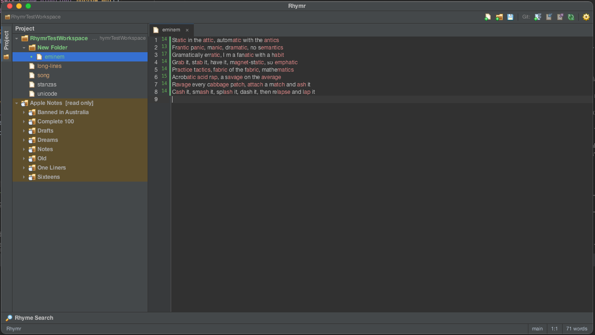

# Rhymr

**Rhymr** is a fast, distraction-free writing app for poets, lyricists and MCs. It puts the
tools you actually use while writing — syllable counts, rhyme colouring, a rhyme finder,
version history — into one workspace that feels like a professional editor.

It's free and open source. There's no download yet; you build it yourself from this repo
(see Quick Start).

# ⚠️
> **Note:** Rhymr is still **work in progress** with **no release available**

## Features

* **Rhyme highlighting** — words that rhyme are colour-grouped as you type, laid out like a
  rhyme-scheme breakdown, including partial and multi-syllable rhymes.
* **Syllable counts** — a live count in the margin next to every line.
* **Rhyme finder** — look up rhymes, near-rhymes and same-sounding words for any word,
  grouped by syllable count.
* **Writing stats** — word count and cursor position always in view.
* **Stanza lock** — the line that starts the section you're in stays pinned to the top
  while you scroll a long piece.
* **Projects and files** — open a folder and browse, create, rename, move and delete files
  in a side tree.
* **Version history built in** — see which lines you've changed since your last commit,
  marked in the margin, and commit, push, pull and fetch without leaving the app. The
  current branch shows at the bottom of the window.
* **Light and dark themes** — a classic dark scheme and a light one, with colour or plain
  icons.
* **Familiar layout** — a toolbar, side panels, a welcome screen and a start-up splash, in
  the style of a professional code editor.
* **Settings that apply instantly** — change the font, theme or options and see it on your
  open documents right away.
* **Mac and Windows** — Mac is fully supported; Windows support is in progress.

## Showcase



### Quick Start

#### Prerequisites

> [See Cargo.toml](https://github.com/rhymr/win-mac/blob/main/Cargo.toml)

#### 1. **Clone the repository**:
```bash
git clone https://github.com/rhymr/win-mac.git
cd rhymr-win-mac
```
#### 2. **Build and run**:
```bash
cargo run --release
```

### License

Distributed under the MIT License. See `LICENSE` for more information.
